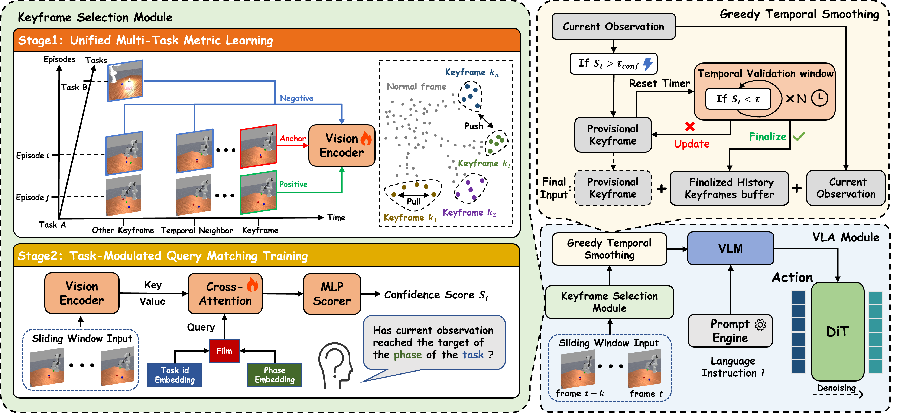

# Non-Markovian Long-Horizon Robot Manipulation via Keyframe Chaining


## 📌 Overview

We presented Keyframe-Chaining VLA, resolving non-Markovian ambiguity via Sparse Semantic History. Our Task-Modulated KSM extracts event-driven keyframes to efficiently ground long-horizon dependencies, achieving a 92.0% success rate on our ManiSkill Benchmark and robust real-world performance.

## 🛠️ Preparation

Here we provide a conda environment setup for the project.
```bash
# clone the repository
git clone https://github.com/cyp123cyp/KC-VLA.git
cd KC-VLA
    
conda create -n kcvla python=3.10
conda activate kcvla
# install dependencies
pip install -r requirements.txt
# Install ffmpeg (required only for torchcodec(real-bot))
conda install -c conda-forge ffmpeg==7.1.1
# Install Flash Attention (required for efficient VLA inference)
pip install --no-build-isolation flash-attn==2.7.1.post4
```

## 💾 Dataset

While we utilize [ManiSkill](https://github.com/haosulab/ManiSkill) as our simulation backbone, all long-horizon, memory-dependent datasets used in this project are custom-generated to support our research on Keyframe-Chaining VLA. 

For detailed instructions on how to generate, download, and utilize our custom datasets, please refer to our dedicated benchmark repository: **[VLA Memory Dependence Benchmark](https://github.com/cytoplastm/VLA_Memory_dependence_benchmark)**.

1. Generate via Our Collection Pipeline
If you prefer to collect the simulation data from scratch or modify the environment parameters, please follow the **Data Generation** instructions detailed in our benchmark repository: 
👉 **[VLA Memory Dependence Benchmark - Data Generation](https://github.com/cytoplastm/VLA_Memory_dependence_benchmark)**

2. Download from Hugging Face
You can also download from [Hugging Face](https://huggingface.co/datasets/furry123/ManiSkill-Memory-dependence).Please note that the uploaded dataset has already been converted into the **LeRobot format** .

## ⚙️ Training

1. Training the keyframe selection module

```bash
python keyframe_selection_module/train_stage1.py
python keyframe_selection_module/train_stage2.py
```

2. Training Keyframe Chaining VLA

```bash
python scripts/gr00t_finetune.py \
    --dataset-path path/to/your/lerobot_datasets \
    --num-gpus 1 \
    --video-backend decord \
    --report-to tensorboard
```

## 📈 Evaluation

The evaluation is deployed in a client–server architecture, where the policy model runs as a service and the ManiSkill environment interacts with it as a client. To evaluate the model on ManiSkill, follow the steps below.

Step 1: Launch the Policy Service(use kcvla Environment)
```bash
# Start the policy inference service
python scripts/inference_service.py
```

Step 2: Launch the ManiSkill Client(use Maniskill Environment)
```bash
# Start the ManiSkill client
python evaluate/eval_for_maniskill.py
```

## 🙏 Acknowledgments

- [ManiSkill](https://github.com/haosulab/ManiSkill) - Original Robotics Simulation
- [SAPIEN](https://sapien.ucsd.edu/) - Physics simulation engine
- [Issac GR00T](https://github.com/NVIDIA/Isaac-GR00T) - VLA base model
- All contributors and community members

## 📞 Contact

- **Project Maintainer**: [cytoplastm](https://github.com/cytoplastm)
- **Email**: [cytoplastm@126.com](mailto:cytoplastm@126.com)
- **Project Link**: https://github.com/cytoplastm/VLA_Memory_dependence_benchmark

## 📝 Citation

If you find this project or the custom ManiSkill benchmark useful for your research, please consider citing:

```bibtex
@article{KC-VLA,
  title={Non-Markovian Long-Horizon Robot Manipulation via Keyframe Chaining},
  author={Yipeng Chen and Wentao Tan and Lei Zhu and Fengling Li and Jingjing Li and Guoli Yang and Heng Tao Shen},
  journal={arXiv preprint arXiv},
  year={2026},
}